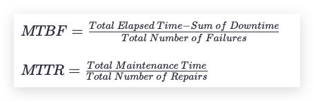
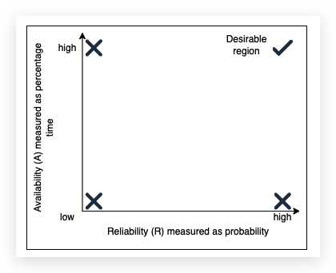

## What is reliability?[#](https://www.educative.io/courses/grokking-modern-system-design-interview-for-engineers-managers/7AyYOGyWkrG#What-is-reliability?)

**Reliability**, `R`, is the probability that the service will perform its functions for a specified time. `R` measures how the service performs under varying operating conditions.

We often use **mean time between failures (MTBF)** and **mean time to repair (MTTR)** as metrics to measure `R`.

(We strive for a higher MTBF value and a lower MTTR value.)

### Reliability and availability[#](https://www.educative.io/courses/grokking-modern-system-design-interview-for-engineers-managers/7AyYOGyWkrG#Reliability-and-availability)

Reliability and availability are two important metrics to measure compliance of service to agreed-upon service level objectives (SLO).

The measurement of availability is driven by time loss, whereas the frequency and impact of failures drive the measure of reliability. Availability and reliability are essential because they enable the stakeholders to assess the health of the service.

Reliability (`R`) and availability (`A`) are two distinct concepts, but they are related. Mathematically, `A` is a function of `R`. This means that the value of `R` can change independently, and the value of `A` depends on `R`. Therefore, it’s possible to have situations where we have:

- low `A`, low `R`
- low `A`, high `R`
- high `A`, low `R`
- high `A`, high `R` (desirable)

Availability as a function of reliability